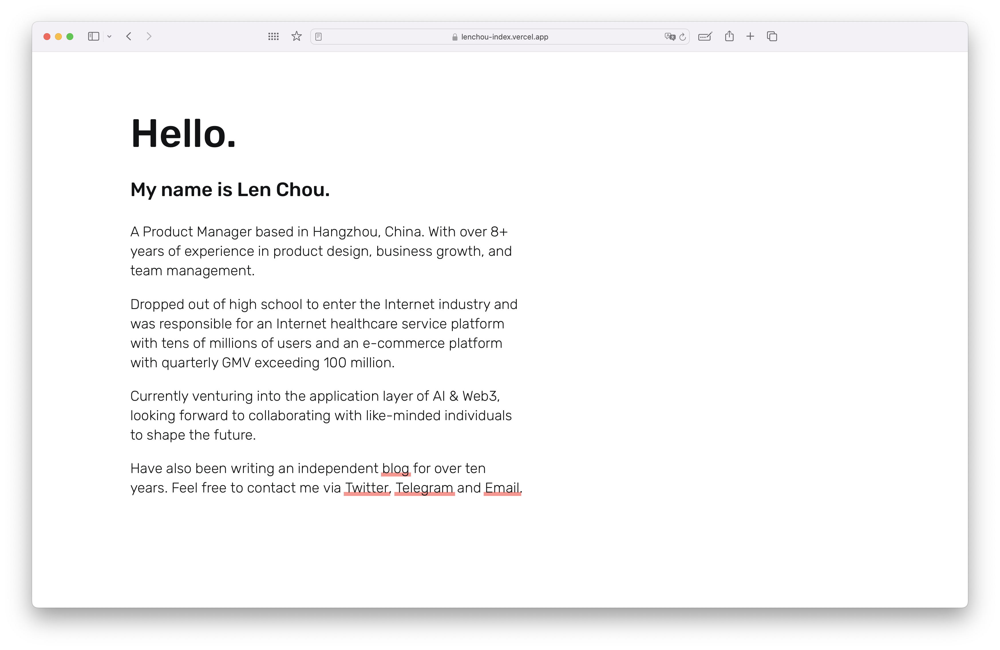

# Len Chou's index Website

Welcome to my personal website! This repository contains the source code for my website, where you can learn more about me and my work.

Demo：[https://lenchou.com](https://lenchou.com)

## Screenshot

## About Me

I'm Len Chou, a Product Manager based in Hangzhou, China, with over 8+ years of experience in product design, business growth, and team management. 

I have a unique background, having dropped out of high school to enter the Internet industry. Over the years, I've been responsible for an Internet healthcare service platform with tens of millions of users and an e-commerce platform with quarterly GMV exceeding 100 million.

Currently, I'm venturing into the application layer of AI & Web3 and looking forward to collaborating with like-minded individuals to shape the future. I've also been writing an independent [blog](https://imzl.com) for over ten years.

## Contact Me

Feel free to reach out to me through the following channels:
- Twitter: [lenchou95](https://twitter.com/lenchou95)
- Telegram: [lenchou95](https://t.me/lenchou95)
- Email: [wwwzhouliang@gmail.com](mailto:wwwzhouliang@gmail.com)

## License

This website is open-source under the [MIT License](LICENSE).
